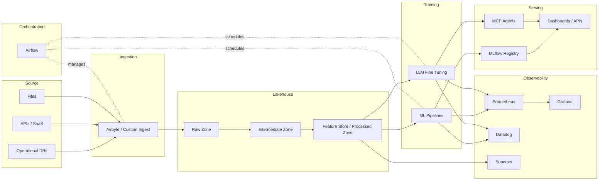

# Architecture Overview

Describe the end-to-end topology of the lakehouse stack, including ingestion sources, storage layers, processing engines, orchestration, observability, and user-facing analytics.

For le plan d’implémentation infra on-prem, voir `docs/INFRA_ROADMAP.md`.

Adapt the diagram as the architecture evolves (cloud vs on-prem, additional services, etc.).
